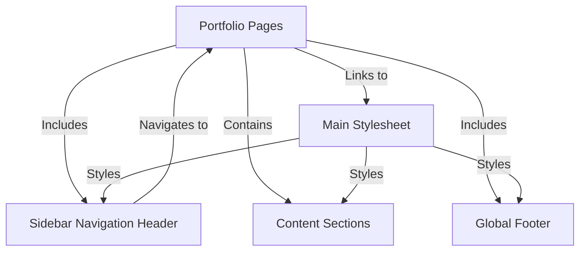
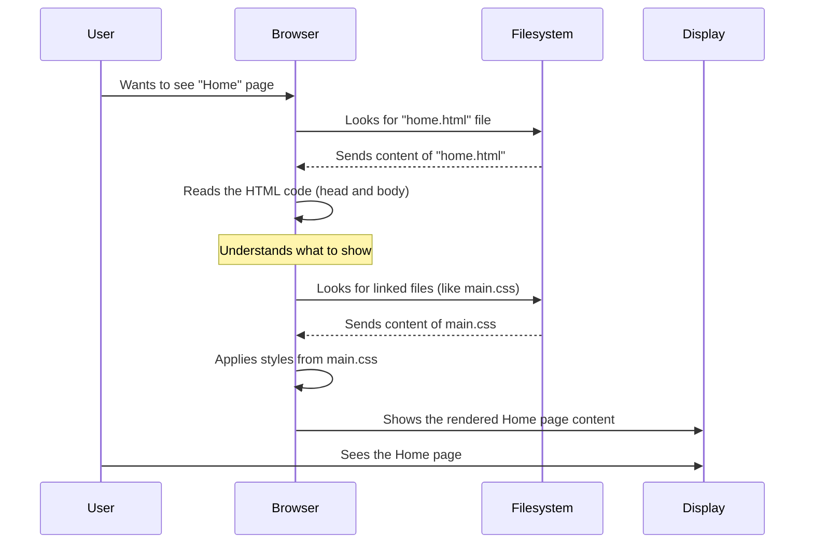
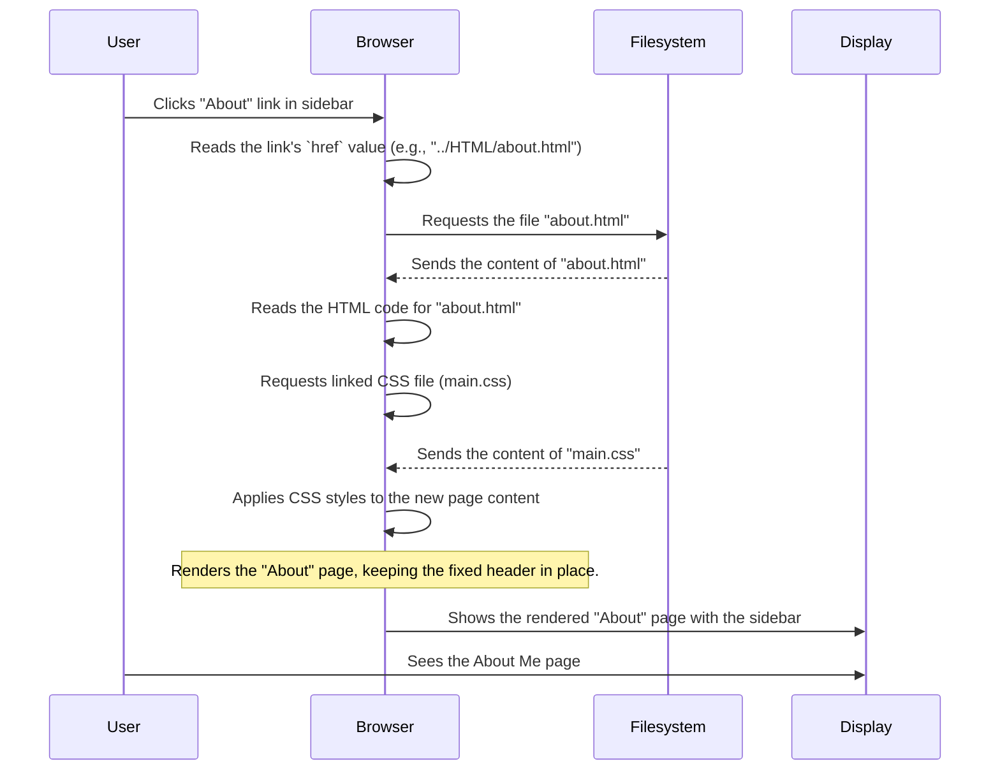
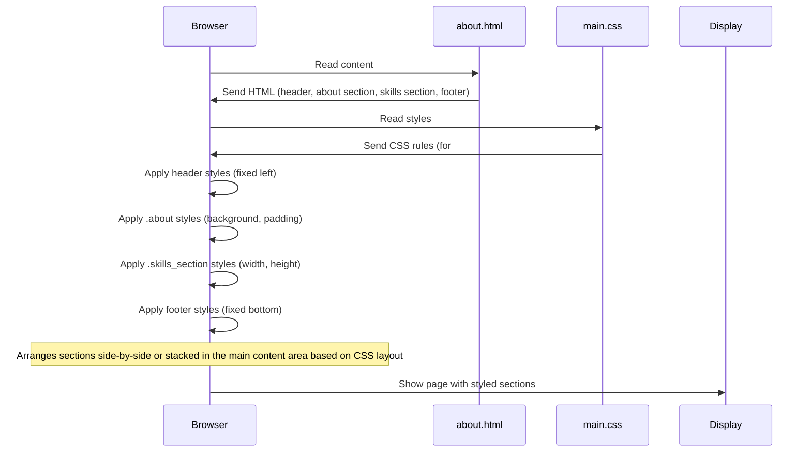
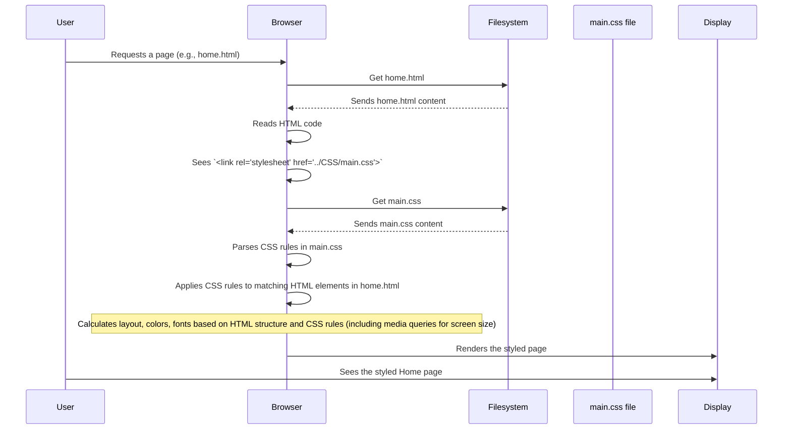

# Tutorial: Portfolio-HTML

This project is a **simple portfolio website** designed to showcase information about an individual.
It consists of several *HTML pages* representing different sections like Home, About, Blogs, and Contact.
A fixed *sidebar* provides navigation and profile links, while the main content is organized into distinct *sections* on each page.
The entire site's visual appearance is controlled by a *single CSS stylesheet*, and some pages also include a *global footer*.


## Visual Overview



## Chapters

1. [Portfolio Pages
](01_portfolio_pages_.md)
2. [Sidebar Navigation Header
](02_sidebar_navigation_header_.md)
3. [Content Sections
](03_content_sections_.md)
4. [Global Footer
](04_global_footer_.md)
5. [Main Stylesheet
](05_main_stylesheet_.md)

---

<sub><sup>Generated by [AI Codebase Knowledge Builder](https://github.com/The-Pocket/Tutorial-Codebase-Knowledge).</sup></sub>

# Chapter 1: Portfolio Pages

Welcome to the first chapter of our tutorial on the `Portfolio-HTML` project! We're going to start right at the foundation of any website: its pages.

Imagine a website is like a house. A house isn't just one big, empty space; it has different rooms like a living room, kitchen, bedroom, and bathroom, each serving a different purpose. You move between these rooms to do different things.

Similarly, a website isn't usually just one giant file. To organize content and make it easy for visitors to find information, websites are broken down into different *pages*. Each page is typically its own file, dedicated to a specific topic or section of the website.

For our `Portfolio-HTML` project, the main idea is to create a simple website to showcase your work and information about yourself. To do this effectively, we have dedicated pages for different aspects:

*   **Home Page:** This is usually the first page visitors see. It gives a quick introduction.
*   **About Page:** This page tells visitors more about *you*, your background, and your skills.
*   **Blogs & Projects Page:** This is where you showcase your blog posts or projects.
*   **Contact Page:** This page provides ways for people to get in touch with you.

These different sections correspond directly to different HTML files in our project.

## What are Portfolio Pages?

In this project, the "Portfolio Pages" are the main HTML files that represent each distinct section of your website. Think of them as the blueprints for each "room" in your website house.

You'll find these files in the `HTML` folder of the project:

*   `home.html`
*   `about.html`
*   `blogs.html`
*   `contacts.html`

Each of these `.html` files contains the structure and basic content for its specific page.

## How Do They Work?

When you visit a website, your web browser (like Chrome, Firefox, or Edge) downloads and displays the content of an HTML file. When you click a link to go to a different part of the website (like clicking "About"), the browser is actually told to go get and display a *different* HTML file.

Let's look at a simplified version of one of these files, say `home.html`, to see the basic structure:

```html
<!DOCTYPE html>
<html lang="en">
<head>
    <meta charset="UTF-8">
    <meta name="viewport" content="width=device-width, initial-scale=1.0">
    <title>Portfolio | Home</title>
    <!-- Other setup stuff goes here -->
    <link rel="stylesheet" href="../CSS/main.css">
</head>
<body>
    <!-- All the visible content of the Home page goes here -->
    <section class="home">
        <h1>Hi I'm Sehandu Siriwardhana.</h1>
        <!-- ... rest of home page content ... -->
    </section>
    <!-- ... maybe a footer ... -->
</body>
</html>
```

This might look like a lot, but the core idea is simple:

1.  `<!DOCTYPE html>`: This tells the browser it's an HTML5 document.
2.  `<html lang="en">`: This is the root of the page, indicating the language is English.
3.  `<head>`: This section contains important information *about* the page that isn't displayed on the page itself, like the title that appears in the browser tab (`<title>`), character set (`<meta charset="UTF-8">`), and links to external files like CSS stylesheets (`<link rel="stylesheet" href="../CSS/main.css">`) that control the page's look.
4.  `<body>`: This section contains *everything* that you actually see on the webpage, like headings, text, images, forms, etc.

Each of our portfolio's HTML files (`home.html`, `about.html`, `blogs.html`, `contacts.html`) has this basic structure. The main difference between them is the content inside the `<body>` section, which is tailored specifically for that page's purpose. They also have a different `<title>` to show what page you're on in the browser tab.

For example, the `about.html` file will have content specifically about you, while `contacts.html` will have contact forms and information.

Here's a tiny peek at the start of `about.html`:

```html
<!DOCTYPE html>
<html lang="en">
<head>
    <meta charset="UTF-8">
    <meta name="viewport" content="width=device-width, initial-scale=1.0">
    <title>Portfolio | About Me</title>
    <!-- Other setup stuff -->
    <link rel="stylesheet" href="../CSS/main.css">
</head>
<body>
    <!-- Content specific to the About page -->
    <section class="about">
         <h2>About <span>Me</span></h2>
         <!-- ... rest of about page content ... -->
    </section>
    <!-- ... -->
</body>
</html>
```
Notice how the `<title>` and the content inside the `<body>` are different from `home.html`.

## How Your Browser Loads a Page

When you open one of these HTML files in your browser (either by typing its address or clicking a link), here's a simplified sequence of what happens:



If the user then clicks a link to the "About" page, the process repeats, but this time the browser requests and displays the `about.html` file instead.

This structure of having multiple HTML files allows us to create distinct sections for our portfolio website, making it organized and easy for visitors to navigate.

## In Summary

In this chapter, we learned that our portfolio website is made up of several main HTML files (`home.html`, `about.html`, `blogs.html`, `contacts.html`). Each file represents a different "page" or section of the website, much like different rooms in a house. We saw the basic structure of an HTML file, with the `<head>` section for setup information and the `<body>` section for visible content. We also got a simple overview of how the browser loads and displays these separate files as different pages.

These pages are the foundation, but how do visitors move between them? That's where navigation comes in!

In the next chapter, we'll look at the **Sidebar Navigation Header**, which is the part of the website that helps users jump between these different pages.

[Sidebar Navigation Header](02_sidebar_navigation_header_.md)

---

<sub><sup>Generated by [AI Codebase Knowledge Builder](https://github.com/The-Pocket/Tutorial-Codebase-Knowledge).</sup></sub> <sub><sup>**References**: [[1]](https://github.com/Sehandu-Siriwardhana/Portfolio-HTML/blob/6e215dd3513894562ee6b720ee17abd2641432e1/HTML/about.html), [[2]](https://github.com/Sehandu-Siriwardhana/Portfolio-HTML/blob/6e215dd3513894562ee6b720ee17abd2641432e1/HTML/blogs.html), [[3]](https://github.com/Sehandu-Siriwardhana/Portfolio-HTML/blob/6e215dd3513894562ee6b720ee17abd2641432e1/HTML/contacts.html), [[4]](https://github.com/Sehandu-Siriwardhana/Portfolio-HTML/blob/6e215dd3513894562ee6b720ee17abd2641432e1/HTML/home.html)</sup></sub>

# Chapter 2: Sidebar Navigation Header

Welcome back! In [Chapter 1: Portfolio Pages](01_portfolio_pages_.md), we learned that our portfolio website is built using different HTML files, like `home.html`, `about.html`, and so on, acting like separate rooms in our website's house.

But how do visitors easily move between these rooms? Imagine a house without hallways or doors – you'd be stuck in one room! Websites need navigation to let users jump from one page (HTML file) to another.

This is where the **Sidebar Navigation Header** comes in. Think of it as the main directory or menu board for your entire portfolio website. On bigger screens, it typically stays visible and fixed on the left side, providing a quick way to identify whose portfolio it is and navigate through its sections.

## What is the Sidebar Navigation Header?

In our project, the Sidebar Navigation Header is the dedicated area you see on the left side (especially on wider computer screens). It's fixed, meaning it stays in place even when you scroll the main content of the page.

Its main job is to:
1.  **Identify:** Show who the portfolio belongs to (profile picture, name).
2.  **Connect:** Provide links to your social media profiles.
3.  **Navigate:** Offer a clear menu to visit the different [Portfolio Pages](01_portfolio_pages_.md) (`Home`, `About`, `Blogs & Projects`, `Contact`).

It's structured in our HTML using a main container element, a `<header>` tag with the ID `header`, and inside it, a `<nav>` tag with the ID `navbar` specifically for the navigation menu links.

Let's look at the HTML structure found near the top of *every* HTML page file in the `HTML` folder:

```html
<!--  ======= Header =======  -->
<header id="header">
  <!-- Profile Info Area -->
  <div class="profile">
    
    <h1 class="text-light"><a href="../HTML/home.html">Sehandu Siriwardhana</a></h1>
    <div class="social-links">
      <a href="#" class="twitter"><i class="bx bxl-twitter"></i></a>
      <a href="#" class="facebook"><i class="bx bxl-facebook"></i></a>
      <!-- ... more social links ... -->
    </div>
  </div>

  <!-- Navigation Menu Area -->
  <nav id="navbar" class="nav-menu navbar">
    <ul>
      <li><a href="../HTML/home.html" class="active"><i class="bx bx-home"></i> <span>Home</span></a></li>
      <li><a href="../HTML/about.html" class=""><i class="bx bx-user"></i> <span>About</span></a></li>
      <!-- ... more navigation links ... -->
    </ul>
  </nav>
</header>
<!-- End Header -->
```
*(This is a simplified snippet from files like `home.html`, `about.html`, etc. The full code includes all social links and navigation links.)*

Here's what's happening in that code:

*   `<header id="header">`: This is the main box holding everything for the sidebar. The `id="header"` is like a unique name so we can specifically style *this* header differently from other parts of the page using CSS.
*   `<div class="profile">`: Inside the header, this section holds the profile picture (``), the name (`<h1>` with a link back to the home page), and the social media links (`<a>` tags inside a `div` with class `social-links`).
*   `<nav id="navbar" class="nav-menu navbar">`: This is the navigation part. The `<nav>` tag is specifically for navigation links. Again, `id="navbar"` and classes like `nav-menu` give us ways to style the menu.
*   `<ul>` and `<li>`: This is a standard way to create lists in HTML. `<ul>` means "unordered list" (like a bulleted list), and each `<li>` is a "list item". In menus, each list item is usually one link.
*   `<a href="...">`: These are the actual links! The `href` attribute tells the browser *which* page (HTML file) to go to when the link is clicked. Notice how they point to files like `../HTML/home.html` and `../HTML/about.html`, referencing the pages we discussed in Chapter 1.
*   `<i>`: These tags are used here to display small icons next to the menu text, making the navigation look nicer.

## How Does it Stay Fixed on the Side?

The magic that makes this sidebar stick to the left side and stay there when you scroll comes from CSS (Cascading Style Sheets). In our project, the styles for the header are in the `CSS/main.css` file.

Here are some key CSS rules from `main.css` that control the sidebar's position and appearance:

```css
#header {
  position: fixed; /* Makes the element stay in a fixed position */
  top: 0;          /* Aligns it to the top edge */
  left: 0;         /* Aligns it to the left edge */
  bottom: 0;       /* Stretches it to the bottom edge */
  width: 300px;    /* Sets its width */
  z-index: 9997;   /* Ensures it's above most other content */
  background-image: linear-gradient(to left,black ,#621708); /* Adds a cool background color/gradient */
  overflow-y: auto; /* Adds a scrollbar if content is too long */
}

#main { /* This is the area next to the header */
  margin-left: 300px; /* Pushes the main content away from the fixed header */
}

@media (max-width: 1199px) {
  #header {
    left: -300px; /* Moves the header off-screen to the left on smaller screens */
  }
  #main {
    margin-left: 0; /* Allows the main content to take up the full width */
  }
  /* ... other mobile styles ... */
}
```
*(These are simplified snippets from `CSS/main.css`.)*

Let's break down the important parts:

*   `#header { ... }`: These rules apply specifically to the element with `id="header"` (our sidebar container).
    *   `position: fixed;`: This is the crucial part! It tells the browser to position this element relative to the browser window itself, *not* relative to where it would normally sit in the page's flow. This makes it stay put as you scroll.
    *   `top: 0;`, `left: 0;`, `bottom: 0;`: These tell the browser exactly where to place the fixed element – aligned to the top and left edges, and stretching down to the bottom edge of the window.
    *   `width: 300px;`: This sets how wide the sidebar is.
    *   `background-image: ...;`: Sets the visual style.
*   `#main { margin-left: 300px; }`: The main content of our pages (like the About Me section, Skills section, etc.) is usually in a container that comes *after* the header in the HTML. This rule tells the main content area to leave a 300-pixel gap on its left side, exactly the width of the fixed header, so the content doesn't hide *behind* the header.
*   `@media (max-width: 1199px) { ... }`: This is a media query. It means the styles inside these curly braces (`{}`) *only* apply when the browser window is 1199 pixels wide or less (like on tablets or phones).
    *   `#header { left: -300px; }`: On small screens, we don't have space for a wide fixed sidebar. This rule moves the header completely off the screen to the left. (Typically, a mobile menu button would then appear to toggle it open, though that might be handled by JavaScript which isn't covered here).
    *   `#main { margin-left: 0; }`: On small screens, since the header is hidden, the main content area no longer needs that 300px gap and can use the full width.

## How it Works When You Click a Link

When you click a link in the sidebar navigation (like the "About" link), here's a simplified idea of what the browser does:



Because the header HTML structure and the linking to `main.css` are included in *every* HTML page file (as seen in the provided code snippets for `home.html`, `about.html`, `blogs.html`, `contacts.html`), the sidebar appears consistently on every page. The fixed positioning from the CSS ensures it stays visible as you scroll the content next to it.

The navigation links (`<a href="...">`) are the doors that let you move between the different "rooms" ([Portfolio Pages](01_portfolio_pages_.md)) of your website. The `active` class on the navigation link (`<a class="active">`) for the *current* page is handled by adding or removing that class in the HTML itself (you'll notice the code for `about.html` has `class="active"` on its "About" link, `blogs.html` on its "Blogs & Projects" link, and so on). This `active` class is then styled in CSS (`.nav-menu .active`) to visually indicate which page you are currently viewing.

## In Summary

We've seen how the Sidebar Navigation Header, built using HTML's `<header>` and `<nav>` tags and styled with CSS, creates a fixed, visible hub on the side of our portfolio. It displays key information like your profile and name and, most importantly, provides the links that connect all the different [Portfolio Pages](01_portfolio_pages_.md) together, making the website easy to navigate. The `position: fixed` CSS property is key to keeping it in place on larger screens, while media queries handle its appearance on smaller devices.

Now that we know how to move between pages, let's dive into the main content areas where you'll showcase your work and information.

[Content Sections](03_content_sections_.md)

---

<sub><sup>Generated by [AI Codebase Knowledge Builder](https://github.com/The-Pocket/Tutorial-Codebase-Knowledge).</sup></sub> <sub><sup>**References**: [[1]](https://github.com/Sehandu-Siriwardhana/Portfolio-HTML/blob/6e215dd3513894562ee6b720ee17abd2641432e1/CSS/main.css), [[2]](https://github.com/Sehandu-Siriwardhana/Portfolio-HTML/blob/6e215dd3513894562ee6b720ee17abd2641432e1/HTML/about.html), [[3]](https://github.com/Sehandu-Siriwardhana/Portfolio-HTML/blob/6e215dd3513894562ee6b720ee17abd2641432e1/HTML/blogs.html), [[4]](https://github.com/Sehandu-Siriwardhana/Portfolio-HTML/blob/6e215dd3513894562ee6b720ee17abd2641432e1/HTML/contacts.html), [[5]](https://github.com/Sehandu-Siriwardhana/Portfolio-HTML/blob/6e215dd3513894562ee6b720ee17abd2641432e1/HTML/home.html)</sup></sub>

# Chapter 3: Content Sections

Welcome back to our tutorial! In [Chapter 1: Portfolio Pages](01_portfolio_pages_.md), we learned that our website is made of different HTML files, acting like separate "rooms" for different topics (Home, About, Blogs, Contact). In [Chapter 2: Sidebar Navigation Header](02_sidebar_navigation_header_.md), we explored the navigation bar that helps visitors move between these "rooms".

Now, let's go *inside* one of these rooms (a page) and see how the content *within* that page is organized. Imagine the "About Me" page. You don't just want a giant block of text! You'll likely have a section for your background, maybe another for your skills, and so on. How do we divide the content on a single page into neat, organized areas?

This is where **Content Sections** come in.

## What are Content Sections?

Think of a single page, like our "About Me" page, as one large room. Content sections are like setting up different activity zones within that room. You might have a reading corner, a workspace, or a relaxation area. Each zone has a purpose and contains related items.

On a webpage, Content Sections are distinct areas that group related information. For example, on the "About Me" page, you might have:

*   An "Introduction" section about who you are.
*   A "Skills" section listing your abilities.
*   (The provided code examples also show a "Contact" section and a "Newsletter" section grouped together on the `contacts.html` page, and a "Blogs" section on the `blogs.html` page).

These sections help structure the content on a page, making it much easier for visitors to scan and find the information they're looking for. They also give us specific parts of the page to target with CSS for styling.

## How are Content Sections Created in HTML?

In HTML, we use elements like `<section>` and `<div>` to create these content sections.

*   **`<section>`:** This is a more semantic tag, meaning it's intended for standalone sections of content that might have a heading (like an "About Me" section or a "Skills" section).
*   **`<div>`:** This is a more general-purpose container. It's used when you need to group elements for styling or layout but they don't necessarily form a distinct "section" of content in the semantic sense. In our project, you'll see `<div>` often used *within* a `<section>` to group smaller related items, or sometimes as a main section wrapper itself if `<section>` wasn't chosen.

To make each section unique and identifiable, we give them specific **class names** or **IDs**. These are like labels you put on your activity zones (e.g., "Reading Nook Zone", "Work Desk Zone").

Let's look at some examples from our project files:

From `HTML/home.html`:
```html
<!-- ======= Home Section ======= -->
    <section class="home">
        <div class="home-content">
          <h1>Hi I'm Sehandu Siriwardhana.</h1>
          <h3><span>Computer Science Student.</span></h3>
          <!-- ... rest of home content ... -->
        </div>
      </section>
<!-- End Hero -->
```
Here, the main content area of the home page is wrapped in a `<section>` tag with the class `home`. This clearly marks it as the "Home Section".

From `HTML/about.html`:
```html
<!-- ======= About Section ======= -->
    <section class="about">
        <div class="about">
            <div class="about_head">
                <h2>About <span>Me</span></h2>
            </div>
            <!-- ... rest of about me content ... -->
          </div>
        </div>
      </section>
      <!-- End About Section -->

       <!-- ======= Skills Section ======= -->
       <div class="skills_section">
        <div class="skills_head">
            <h2>My <span>Skills</span></h2>
            <p>Here is my skills to represent my Expertise</p>
        </div>
        <!-- ... rest of skills content ... -->
       </div>
       <!-- End Skills Section -->
```
The `about.html` page contains *two* main content sections:
1.  A `<section>` with the class `about` for the "About Me" details.
2.  A `<div>` with the class `skills_section` for the "Skills" list.

Notice how both are included one after the other within the `<body>` tag (after the header and before the footer). They are separate areas on the *same* page.

From `HTML/blogs.html`:
```html
  <section id="blog-section">
    <div class="blog-head">
      <h3>My <Span>Blogs</Span></h3>
    </div>
    <div class="blog-container">
      <!-- ... blog posts content ... -->
      </div>
      
    </div>
  </section>
```
Here, the blogs content is within a `<section>` with an `id="blog-section"`. Using an ID is another way to uniquely identify an element, typically for JavaScript or specific CSS targeting.

From `HTML/contacts.html`:
```html
    <section class="contactus">
    <div class="contactus">
        <div class="contact_head">
            <h2>Contact <span>Me</span></h2>
        </div>
        <!-- ... contact form and info content ... -->
    </div>

    <div class="newsletter">
        <div class="newsletter_head">
            <h2>Subscribe to <span>Our Newsletter</span></h2>
        </div>
        <!-- ... newsletter form content ... -->
    </div>
</section>
```
The `contacts.html` page shows an interesting structure: a main `<section class="contactus">` which *contains* two major `<div>` elements (`<div class="contactus">` for the contact form/info and `<div class="newsletter">` for the subscription form). This shows how sections can also be nested to create further organization.

In summary, HTML uses `<section>` or `<div>` with unique class names or IDs to define these separate content areas on a page.

## How Do Content Sections Get Their Look?

Just like the navigation sidebar is styled using CSS, these content sections are also given their look and feel through the `CSS/main.css` file.

The class names and IDs we added in the HTML (`.home`, `.about`, `.skills_section`, `#blog-section`, `.contactus`, `.newsletter`) act as selectors in CSS, allowing us to apply specific styles to each section.

For example, from `CSS/main.css`:
```css
/*--------------------------------------------------------------
# Home Section
--------------------------------------------------------------*/
.home{ /* Targets the section with class="home" */
    background-color: #BC3908; /* Sets background color */
    padding:0 20%; /* Adds spacing inside the section */
    height: 100vh; /* Makes it full height of the screen */
    width: 70%; /* Sets width */
    display: flex; /* Helps arrange content inside */
    align-items: center;
    /* ... more styles ... */
}

/*--------------------------------------------------------------
# About
--------------------------------------------------------------*/
.about{ /* Targets the section/div with class="about" */
    margin-top: -8px;
    padding: 0 14.5%;
    background: #FFA41B; /* Sets a different background color */
    /* ... more styles ... */
}

/*--------------------------------------------------------------
# Skills
-------------------------------------------------------------*/
.skills_section{ /* Targets the div with class="skills_section" */
    width: 100%;
    height: 100vh;
    padding: 0 14.5%;
    /* display: flex; */ /* Also helps with layout */
    /* ... more styles ... */
}
```
These CSS rules tell the browser how each section should look: its background color, how much space should be around the content (padding), its size (width, height), and how the items inside should be arranged (`display: flex` or `display: grid`).

Because each section has a unique class or ID, we can give them completely different styles, making the "About" section look distinct from the "Skills" section, even though they are on the same page (`about.html`).

## How it Works When You View a Page

When your browser loads an HTML page (like `about.html`), it reads the structure from top to bottom.



The browser first lays out the main structure defined in the HTML `<body>` (the header, followed by the content sections, followed by the footer). Then, it applies the styles from `main.css`. The CSS rules for `#header` make the header fixed on the left. The CSS rules for `.about`, `.skills_section`, `#blog-section`, `.contactus`, `.newsletter` then define how *those specific areas* within the main content space look and behave. This allows us to have different visual styles and layouts for different types of content, all on the same page.

## In Summary

Content sections are key to organizing the information *within* each page of your portfolio. We use HTML elements like `<section>` and `<div>`, combined with unique class names or IDs, to define these distinct areas. The `CSS/main.css` file then uses these class names and IDs to apply specific styles, giving each section its unique appearance and layout. This creates a clear, structured flow of information on each page, making your portfolio easy to read and understand.

Now that we've looked at the content within the main part of the page, let's check out another important structural element that appears on all pages: the footer.

[Global Footer](04_global_footer_.md)

---

<sub><sup>Generated by [AI Codebase Knowledge Builder](https://github.com/The-Pocket/Tutorial-Codebase-Knowledge).</sup></sub> <sub><sup>**References**: [[1]](https://github.com/Sehandu-Siriwardhana/Portfolio-HTML/blob/6e215dd3513894562ee6b720ee17abd2641432e1/CSS/main.css), [[2]](https://github.com/Sehandu-Siriwardhana/Portfolio-HTML/blob/6e215dd3513894562ee6b720ee17abd2641432e1/HTML/about.html), [[3]](https://github.com/Sehandu-Siriwardhana/Portfolio-HTML/blob/6e215dd3513894562ee6b720ee17abd2641432e1/HTML/blogs.html), [[4]](https://github.com/Sehandu-Siriwardhana/Portfolio-HTML/blob/6e215dd3513894562ee6b720ee17abd2641432e1/HTML/contacts.html), [[5]](https://github.com/Sehandu-Siriwardhana/Portfolio-HTML/blob/6e215dd3513894562ee6b720ee17abd2641432e1/HTML/home.html)</sup></sub>

# Chapter 4: Global Footer

Welcome back! In [Chapter 1: Portfolio Pages](01_portfolio_pages_.md), we saw that our website is made of several distinct HTML files for different pages. In [Chapter 2: Sidebar Navigation Header](02_sidebar_navigation_header_.md), we learned about the fixed sidebar that helps navigation. And in [Chapter 3: Content Sections](03_content_sections_.md), we explored how to organize the main content *within* those pages using sections and divs.

Now, let's look at another part of the page that appears consistently: the bottom section, usually called the **footer**.

## What is the Global Footer?

Just like books often have information like the publisher or copyright on the last page, websites often have a footer at the very bottom. This area is typically used for information that isn't part of the main content but is important for the site as a whole.

In our `Portfolio-HTML` project, the Global Footer (`<footer id="footer">`) is a small section that appears at the bottom of pages like the Home, About, and Contact pages. Its main job is to display:

1.  **Copyright Information:** A standard way to state who owns the content and the year.
2.  **Credits:** A small mention of who designed or built the website.

Although on smaller screens it might just sit at the very end of the page content, the design of this project makes it appear fixed at the bottom *alongside* the [Sidebar Navigation Header](02_sidebar_navigation_header_.md) on larger computer screens. This gives it a slightly different, more integrated feel than a typical page-bottom footer.

## How is the Global Footer Created in HTML?

In HTML, the footer is typically represented by the `<footer>` tag. This is a semantic tag, meaning it tells the browser (and developers) that this section contains footer content for its nearest ancestor sectioning element (like the `<body>` or a `<article>`).

In our project, the footer HTML is placed near the very end of the `<body>` section in the `home.html`, `about.html`, and `contacts.html` files.

Here's the HTML structure you'll find in those files:

```html
<!-- ======= Footer ======= -->
<footer id="footer">
  <div class="">
    <div class="copyright">
      &copy; Copyright <strong><span>Portfolio | Sehandu </span></strong>
    </div>
    <div class="credits">
      Designed by <a href="../HTML/about.html">Sehandu Siriwardhana</a>
    </div>
  </div>
</footer>
<!-- End  Footer -->
```
Let's break this down:

*   `<footer>`: This is the main container element for the footer content.
*   `id="footer"`: Like the header, giving it an ID allows us to specifically target *this* footer with CSS or JavaScript.
*   `<div class="">`: A simple container div inside the footer. (Note: this one doesn't have a specific class, but it still helps group the content).
*   `<div class="copyright">`: A div specifically for the copyright information.
    *   `&copy;`: This is an HTML entity code that displays the copyright symbol (©).
    *   `<strong>`: Makes the text inside bold.
    *   `<span>`: Used here potentially for styling parts of the title.
*   `<div class="credits">`: A div for the credits information.
    *   `<a href="../HTML/about.html">`: A link within the credits, pointing back to the [About Page](01_portfolio_pages_.md).

This simple HTML structure provides the basic text content and links for the footer. Because this exact code block is included in multiple HTML files, the footer appears on those pages consistently.

## How Does it Stay Fixed on the Side?

Similar to the [Sidebar Navigation Header](02_sidebar_navigation_header_.md), the magic that makes the footer appear fixed at the bottom *next to the sidebar* on larger screens comes from CSS, specifically in the `CSS/main.css` file.

Here are the key CSS rules for the footer:

```css
#footer {
    padding: 15px;       /* Space inside the footer */
    color: #f4f6fd;      /* Text color */
    font-size: 14px;
    position: fixed;     /* Makes it stay in a fixed position */
    left: 0;             /* Aligns it to the left edge */
    bottom: 0;           /* Aligns it to the bottom edge */
    width: 300px;        /* Sets its width to match the header */
    z-index: 9999;       /* Ensures it's above almost everything else */
    background-image: linear-gradient(to right,black ,#621708); /* Background style */
}

#footer .copyright{
  text-align: center; /* Center text inside copyright div */
}

#footer .credits{
  padding-top: 5px;
  text-align: center; /* Center text inside credits div */
  font-size: 13px;
  color: #eaebf0;
}

#footer .credits a{
  color: #FF8B01; /* Link color */
}

@media (max-width: 1199px) {
  #footer {
    position: static; /* Removes fixed positioning on smaller screens */
    width: auto;      /* Allows width to adjust automatically */
    padding-right: 20px 15px; /* Adjusts padding */
  }
}
```
Let's look at the crucial parts, especially how it relates to the header:

*   `#footer { ... }`: These rules apply to the footer element.
    *   `position: fixed;`: This is the key property, just like with the header. It makes the footer stay in place relative to the browser window.
    *   `left: 0;`: Aligns it to the left edge of the window.
    *   `bottom: 0;`: Aligns it to the bottom edge of the window.
    *   `width: 300px;`: This is important! It sets the footer's width to exactly match the width of the `#header`. This makes it sit neatly at the bottom of the fixed sidebar area.
    *   `z-index: 9999;`: Gives it a high stacking order, ensuring it appears on top of other content.
    *   `background-image: ...;`: Sets the visual style, similar to the header.
*   `.copyright`, `.credits`, `.credits a`: These apply styles to the text and links *within* the footer, controlling alignment, color, etc.
*   `@media (max-width: 1199px) { ... }`: Again, a media query for smaller screens.
    *   `position: static;`: This changes the footer's positioning back to the default. On smaller screens, the fixed sidebar disappears, and the footer behaves like a normal footer, appearing at the very end of the main content below everything else.
    *   `width: auto;`: The footer no longer needs to be exactly 300px wide; it can stretch to fill the available width of the page content area.

So, on larger screens, both the header and footer use `position: fixed` and a `width` of 300px, which places them together on the left side of the screen, with the main content area (`#main` with `margin-left: 300px`) filling the space to their right.

## How it Works When You View a Page

When you open one of the HTML files that includes the footer (like `about.html`), the browser processes the file:

```mermaid
sequenceDiagram
    participant Browser
    participant HTML File (e.g., about.html)
    participant main.css
    participant Display

    Browser->>HTML File: Read HTML content (header, content, footer)
    HTML File-->>Browser: Sends HTML structure
    Browser->>main.css: Request and read CSS styles
    main.css-->>Browser: Sends CSS rules (#header, .about, .skills_section, #footer)
    Browser->>Browser: Processes HTML structure
    Browser->>Browser: Applies CSS styles
    Note over Browser: Applies position:fixed, width:300px to #header and #footer. Applies styles to content sections.
    Note over Browser: Lays out header and footer fixed on left, content sections in main area pushed right.
    Browser->>Display: Shows the rendered page
    User->>Display: Sees the page with fixed sidebar & footer (on large screen)
```

The browser reads the HTML, sees the `<footer>` tag, and then applies the styles from `main.css`. The `position: fixed` rules for both the `#header` and `#footer` make them lock into place on the screen. Since they both have `left: 0` and are given a specific `width` (300px), they stack vertically on the left side, the header at the top (`top: 0`) and the footer at the bottom (`bottom: 0`), occupying that fixed 300px column.

The main content sections ([Content Sections](03_content_sections_.md)) then appear in the area *next* to this fixed column.

## In Summary

The Global Footer (`<footer id="footer">`) provides essential information like copyright and credits at the bottom of specific [Portfolio Pages](01_portfolio_pages_.md). By including the same footer HTML structure in these pages and applying CSS with `position: fixed`, `left: 0`, `bottom: 0`, and matching the `width` of the header, the footer is designed to appear locked at the bottom of the fixed sidebar area on larger screens. On smaller screens, media queries change its positioning to become a standard footer at the end of the content.

We've now covered the main structural components you'll find consistently across multiple pages: the header (including navigation), the content sections (which change per page), and the footer. All of these elements get their look and feel from the central stylesheet.

In the next chapter, we'll take a closer look at that **Main Stylesheet** (`CSS/main.css`) and understand how it brings the entire website design together.

[Main Stylesheet](05_main_stylesheet_.md)

---

<sub><sup>Generated by [AI Codebase Knowledge Builder](https://github.com/The-Pocket/Tutorial-Codebase-Knowledge).</sup></sub> <sub><sup>**References**: [[1]](https://github.com/Sehandu-Siriwardhana/Portfolio-HTML/blob/6e215dd3513894562ee6b720ee17abd2641432e1/CSS/main.css), [[2]](https://github.com/Sehandu-Siriwardhana/Portfolio-HTML/blob/6e215dd3513894562ee6b720ee17abd2641432e1/HTML/about.html), [[3]](https://github.com/Sehandu-Siriwardhana/Portfolio-HTML/blob/6e215dd3513894562ee6b720ee17abd2641432e1/HTML/contacts.html), [[4]](https://github.com/Sehandu-Siriwardhana/Portfolio-HTML/blob/6e215dd3513894562ee6b720ee17abd2641432e1/HTML/home.html)</sup></sub>

# Chapter 5: Main Stylesheet

Welcome back! In our journey through the `Portfolio-HTML` project, we've explored the foundational [Portfolio Pages](01_portfolio_pages_.md) (Chapter 1), the always-present [Sidebar Navigation Header](02_sidebar_navigation_header_.md) (Chapter 2), the way content is organized *within* a page using [Content Sections](03_content_sections_.md) (Chapter 3), and the consistent [Global Footer](04_global_footer_.md) (Chapter 4).

We've seen the *structure* and the *building blocks* of the website, defined by the HTML files. But so far, we haven't really talked in detail about what makes the site look visually appealing – the colors, fonts, spacing, layout, and how it adapts to different screen sizes.

Imagine you've built the rooms of a house (HTML). Now you need to paint the walls, choose the furniture, hang curtains, and decide where everything goes to make it look good and feel right. That's the job of styling!

This brings us to the core concept of this chapter: the **Main Stylesheet**, which is the `CSS/main.css` file in our project.

## What is the Main Stylesheet?

The `main.css` file is the central command center for the visual appearance of your entire portfolio website. It contains **Cascading Style Sheet (CSS)** rules that tell the web browser *how* to display the HTML elements.

Think of it as the comprehensive interior design plan for your website. It dictates:

*   The background colors and images.
*   The text colors, fonts, and sizes.
*   How much space there is between elements (padding and margin).
*   How elements are positioned (like making the sidebar fixed).
*   How elements behave on different screen sizes (making the site responsive).
*   And much, much more!

Without a stylesheet like `main.css`, your HTML pages would appear as plain, unformatted text with links – functional, but not very engaging!

## How Does HTML Know to Use `main.css`?

We briefly touched on this in Chapter 1. Every single HTML page file in our project (`home.html`, `about.html`, `blogs.html`, `contacts.html`) includes a special line in its `<head>` section:

```html
<head>
    <meta charset="UTF-8">
    <meta name="viewport" content="width=device-width, initial-scale=1.0">
    <title>Portfolio | Home</title>
    <!-- Other setup stuff goes here -->
    <link rel="stylesheet" href="../CSS/main.css"> <!-- This line right here! -->
</head>
```
The `<link>` tag is how an HTML document connects to external resources.

*   `rel="stylesheet"`: This tells the browser that the linked file is a stylesheet.
*   `href="../CSS/main.css"`: This specifies the *path* to the stylesheet file. `../` means "go up one folder from the current location", then it goes into the `CSS` folder and finds `main.css`.

This single line, present in all our HTML pages, ensures that every page uses the same set of styling rules defined in `main.css`, giving the website a consistent look and feel.

## Key Ideas in `main.css`

Let's peek inside the `main.css` file and understand the core concepts.

CSS files are made up of **rules**. A rule generally looks like this:

```css
selector {
  property: value;
  property: value;
  /* ... more properties ... */
}
```

### 1. Selectors: Targeting HTML Elements

The `selector` is how you tell CSS *which* HTML element(s) you want to style. You can select elements based on:

*   **Element Name:** Directly target all elements of a certain type (e.g., `body`, `h1`, `a`, `p`).
*   **Class:** Target all elements with a specific `class` attribute (e.g., `.home`, `.about`, `.profile`). Classes start with a dot (`.`).
*   **ID:** Target the *single* element with a specific `id` attribute (e.g., `#header`, `#footer`, `#blog-section`). IDs start with a hash (`#`).

You can also combine selectors to be more specific.

Here are some simple examples from `main.css` showing different selectors:

```css
body { /* Targets the main body of the page */
  font-family: 'Chakra Petch', sans-serif;
  color: #621708;
}

#header { /* Targets the element with id="header" */
  position: fixed;
  width: 300px;
  /* ... */
}

.about { /* Targets all elements with class="about" */
  background: #FFA41B;
  /* ... */
}

.nav-menu a { /* Targets all <a> elements INSIDE an element with class="nav-menu" */
  color: #b1b4a8;
  /* ... */
}
```
By using different selectors, `main.css` can apply unique styles to different parts of your HTML structure – the main body, the header, specific content sections, links, etc.

### 2. Properties and Values: Defining the Style

Inside the curly braces `{}` of a CSS rule, you list the `property: value;` pairs.

*   **Property:** This is the aspect of the element you want to change (like `color`, `font-size`, `background-color`, `width`, `margin`, `padding`, `position`).
*   **Value:** This is the specific setting for that property (like `#621708`, `14px`, `blue`, `300px`, `10%`, `fixed`).

Here are examples from the snippets, showing various properties and their values:

```css
body {
  font-family: 'Chakra Petch', sans-serif; /* Property: font-family, Value: 'Chakra Petch', sans-serif */
  color: #621708; /* Property: color, Value: #621708 (a specific color code) */
}

#header {
  position: fixed; /* Property: position, Value: fixed */
  top: 0;          /* Property: top, Value: 0 */
  width: 300px;    /* Property: width, Value: 300px */
  background-image: linear-gradient(to left,black ,#621708); /* Complex value for background */
}

.about {
  background: #FFA41B; /* Property: background, Value: #FFA41B */
  padding: 0 14.5%;   /* Property: padding, Value: 0 top/bottom, 14.5% left/right */
}
```
The `main.css` file is filled with thousands of these `property: value;` lines, all grouped by selectors, to define every visual aspect of the website.

### 3. Layout and Positioning

CSS is also crucial for defining the *layout* of elements on the page. We've already seen how `main.css` handles the unique layout of our project:

*   Making the [Sidebar Navigation Header](02_sidebar_navigation_header_.md) fixed on the left:
    ```css
    #header {
      position: fixed; /* Stays put relative to the window */
      left: 0;         /* Aligned to the left edge */
      top: 0;          /* Aligned to the top edge */
      bottom: 0;       /* Stretched to the bottom edge */
      width: 300px;    /* Fixed width */
      /* ... */
    }
    #main {
      margin-left: 300px; /* Pushes main content away from header */
    }
    ```
*   Making the [Global Footer](04_global_footer_.md) appear fixed at the bottom of the sidebar area:
    ```css
    #footer {
        position: fixed;   /* Stays put relative to the window */
        left: 0;           /* Aligned to the left edge */
        bottom: 0;         /* Aligned to the bottom edge */
        width: 300px;      /* Matches header width */
        z-index: 9999;     /* Ensures it's on top */
        /* ... */
    }
    ```
These are just two examples; `main.css` contains many other layout rules using properties like `display` (`flex`, `grid`), `margin`, `padding`, `width`, `height`, etc., to arrange all the content sections and elements within them.

### 4. Responsiveness with Media Queries

One of the most powerful features in `main.css` is the use of **media queries**. These allow you to apply styles *only* when certain conditions are met, most commonly when the screen size is within a specific range. This is how the website adapts to look good on phones, tablets, and desktops.

The syntax looks like this:

```css
@media (condition) {
  /* CSS rules inside here only apply when the condition is true */
}
```

We've seen examples for handling smaller screens:

```css
@media (max-width: 1199px) { /* Applies rules when screen width is 1199px or less */
  #header {
    left: -300px; /* Moves header off-screen */
    /* ... */
  }

  #main {
    margin-left: 0; /* Main content takes full width */
    /* ... */
  }

  #footer {
    position: static; /* Footer is no longer fixed */
    width: auto;      /* Footer adjusts width */
    /* ... */
  }
}
```
This demonstrates how `main.css` contains different sets of rules for different screen sizes, ensuring a good user experience regardless of the device.

## How it Works When the Browser Loads the Page

When your browser loads one of the HTML files (`home.html`, `about.html`, etc.), here's a simplified look at how `main.css` is used:


The browser first understands the structure and content from the HTML. Then, it fetches the `main.css` file and reads all its rules. Finally, it applies these rules to the corresponding HTML elements, creating the final visual output that you see on your screen. Because the *same* `main.css` file is used for multiple HTML pages, the basic styling is consistent across the site.

## HTML (Structure) vs. CSS (Style)

It's helpful to remember the difference:

| Feature          | HTML (.html files)                 | CSS (.css file)                         |
| :--------------- | :--------------------------------- | :-------------------------------------- |
| **Purpose**      | Defines content and structure      | Defines visual appearance and layout    |
| **Analogy**      | The building's blueprint and rooms | The interior design, paint, and furniture |
| **Key Elements** | Tags like `<div>`, `<section>`, `<h1>`, `<a>`, ``, `<footer>`, `<head>`, `<body>` | Selectors (`#`, `.`, element names), Properties (`color`, `width`), Values (`blue`, `300px`), Media Queries (`@media`) |
| **How they connect** | `<link>` tag in the `<head>` | Targets HTML elements using selectors |

They work hand-in-hand: HTML provides the content to be styled, and CSS provides the instructions on *how* to style it.

## In Summary

The `CSS/main.css` file is the heart of your portfolio's design. It contains all the CSS rules that control the visual presentation of your website, from colors and fonts to layout and responsiveness. Each HTML page links to this single stylesheet, ensuring a consistent look across the entire site. By using selectors to target specific HTML elements and defining properties with desired values, the stylesheet transforms the basic HTML structure into the polished website you see. Media queries within the stylesheet allow the design to adapt beautifully to different screen sizes.

We've now covered the main parts of the `Portfolio-HTML` project structure and how they are styled. You have a foundational understanding of how HTML builds the pages and sections, and how CSS brings the visual design to life through the main stylesheet.

---

<sub><sup>Generated by [AI Codebase Knowledge Builder](https://github.com/The-Pocket/Tutorial-Codebase-Knowledge).</sup></sub> <sub><sup>**References**: [[1]](https://github.com/Sehandu-Siriwardhana/Portfolio-HTML/blob/6e215dd3513894562ee6b720ee17abd2641432e1/CSS/main.css)</sup></sub>
